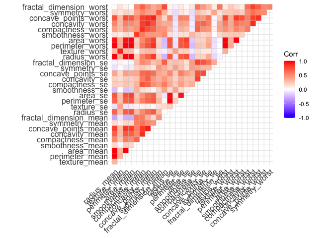
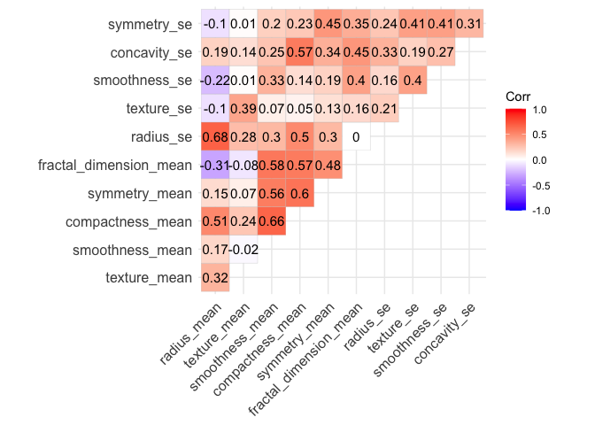

Project 2: Breast Cancer Diagnosis
================
Xinran Sun
3/17/2022

# Objectives

A mammogram is an X-ray image of breast tissue. It can help save lives
because it is easier to treat breast cancer in its early stages before
the cancer is big enough to detect or cause symptoms. However, a wrong
diagnosis can have a negative impact on patients. For example, if there
is a false-positive test result, the doctor sees something that looks
like cancer but is not. This could result in overtreatment that causes
unnecessary side effects on patients. On the other hand, false-negative
test result occurs when a doctor misses cancer tissues, which may delay
the treatment. Therefore, building a model that gives an accurate
classification of the tissue images is necessary to give proper
treatment. In our study, we collected 569 images from both malignant and
benign cancer tissues. Our goal is to build a predictive model to
facilitate cancer diagnosis.

# Dataset

Our data set consistes of 569 rows, with 357 benign and 212 malignant.
We denote 0 for benign and 1 for malignant. We also have 30 columns
representing the features of the tissue images. They include the mean,
standard deviation, and the largest values of the distributions of the
following 10 features computed for the cell nuclei:
# Methods

### Variables Selection

Among the 30 explanatory variables that we have, not all of them are
necessary for the prediction model. Therefore, we dropped the columns
that have high correlation with other columns. The 11 variables we left
in the end have correlations less than 0.7 with each other.

### Logistic Model

Let be the vector with 569 binary response variable, be the 569 × 11
matrix with 11 numerical explanatory variables, and be the vector with
11 corresponding coefficients. We also have as the intercepts.

For our logistic model, the probability of th row be a malignant tissue
is given by:
$$P(y\_i=1\|X\_i) = \\frac{e^{\\beta\_0+\\beta X\_i}}{1+e^{\\beta\_0+\\beta X\_i}}.$$
For likelihood function is:
$$L(\\beta\_0,\\beta) = \\prod\_{i=1}^n \[(\\frac{e^{\\beta\_0+\\beta X\_i}}{1+e^{\\beta\_0+\\beta X\_i}})^{y\_i}(\\frac{1}{1+e^{\\beta\_0+\\beta X\_i}})^{1-y\_i}\].$$
Maximizing the likelihood is equivalent to maximizing the log
likelihood:
$$f(\\beta\_0,\\beta) = \\sum\_{i=1}^n \[y\_i(\\beta\_0+\\beta X\_i)-\\log(1+e^{\\beta\_0+\\beta X\_i})\].$$
The gradient of this function is:
∇*f*(*β*<sub>0</sub>, *β*)=

### Newton-Raphson Algorithm

### Path-wise Coordinate-wise Optimization Algorithm

To obtain a path of solutions with a descending sequence of λ’s in a
logistic-LASSO model, we can implement a path-wise coordinate-wise
optimization algorithm which contains the following steps:
# Results

# Conclusions

# Appendix

### Data preparation

``` r
#load the data
breast_dat = read_csv("breast-cancer.csv") %>% 
  janitor::clean_names() %>% 
  select(-33) %>% #drop NA column
  add_row(id = 92751, diagnosis = "B", radius_mean = 7.76, texture_mean = 24.54,
          perimeter_mean = 47.92, area_mean = 181, smoothness_mean = 0.05263,
          compactness_mean = 0.04362, concavity_mean = 0, 
          concave_points_mean = 0, symmetry_mean = 0.1587,
          fractal_dimension_mean = 0.05884, radius_se = 0.3857, 
          texture_se = 1.428, perimeter_se = 2.548, area_se = 19.15,
          smoothness_se = 0.007189, compactness_se = 0.00466, concavity_se = 0,
          concave_points_se = 0, symmetry_se = 0.02676, 
          fractal_dimension_se = 0.002783, radius_worst = 9.456, 
          texture_worst = 30.37, perimeter_worst = 59.16, area_worst = 268.6,
          smoothness_worst = 0.08996, compactness_worst = 0.06444,
          concavity_worst = 0, concave_points_worst = 0, 
          symmetry_worst = 0.2871, fractal_dimension_worst = 0.07039) 
  #add missing row


head(breast_dat, 5)
```

    ## # A tibble: 5 × 32
    ##         id diagnosis radius_mean texture_mean perimeter_mean area_mean
    ##      <dbl> <chr>           <dbl>        <dbl>          <dbl>     <dbl>
    ## 1   842302 M                18.0         10.4          123.      1001 
    ## 2   842517 M                20.6         17.8          133.      1326 
    ## 3 84300903 M                19.7         21.2          130       1203 
    ## 4 84348301 M                11.4         20.4           77.6      386.
    ## 5 84358402 M                20.3         14.3          135.      1297 
    ## # … with 26 more variables: smoothness_mean <dbl>, compactness_mean <dbl>,
    ## #   concavity_mean <dbl>, concave_points_mean <dbl>, symmetry_mean <dbl>,
    ## #   fractal_dimension_mean <dbl>, radius_se <dbl>, texture_se <dbl>,
    ## #   perimeter_se <dbl>, area_se <dbl>, smoothness_se <dbl>,
    ## #   compactness_se <dbl>, concavity_se <dbl>, concave_points_se <dbl>,
    ## #   symmetry_se <dbl>, fractal_dimension_se <dbl>, radius_worst <dbl>,
    ## #   texture_worst <dbl>, perimeter_worst <dbl>, area_worst <dbl>, …

``` r
r = dim(breast_dat)[1] #row number
c = dim(breast_dat)[2] #column number

var_names = names(breast_dat)[-c(1,2)] #variable names
  
standardize = function(col) {
  mean = mean(col)
  sd = sd(col)
  return((col - mean)/sd)
}

stand_df = breast_dat %>% 
  dplyr::select(radius_mean:fractal_dimension_worst) %>% 
  map_df(.x = ., standardize) #standardize

X = stand_df #predictors
y = as.vector(ifelse(breast_dat[,2] == "M", 1, 0))#response
```

### Check collinearity

``` r
corr = stand_df %>% 
  cor()
corr
```

    ##                          radius_mean texture_mean perimeter_mean    area_mean
    ## radius_mean              1.000000000  0.323781891    0.997855281  0.987357170
    ## texture_mean             0.323781891  1.000000000    0.329533059  0.321085696
    ## perimeter_mean           0.997855281  0.329533059    1.000000000  0.986506804
    ## area_mean                0.987357170  0.321085696    0.986506804  1.000000000
    ## smoothness_mean          0.170581187 -0.023388516    0.207278164  0.177028377
    ## compactness_mean         0.506123578  0.236702222    0.556936211  0.498501682
    ## concavity_mean           0.676763550  0.302417828    0.716135650  0.685982829
    ## concave_points_mean      0.822528522  0.293464051    0.850977041  0.823268869
    ## symmetry_mean            0.147741242  0.071400980    0.183027212  0.151293079
    ## fractal_dimension_mean  -0.311630826 -0.076437183   -0.261476908 -0.283109812
    ## radius_se                0.679090388  0.275868676    0.691765014  0.732562227
    ## texture_se              -0.097317443  0.386357623   -0.086761078 -0.066280214
    ## perimeter_se             0.674171616  0.281673115    0.693134890  0.726628328
    ## area_se                  0.735863663  0.259844987    0.744982694  0.800085921
    ## smoothness_se           -0.222600125  0.006613777   -0.202694026 -0.166776667
    ## compactness_se           0.205999980  0.191974611    0.250743681  0.212582551
    ## concavity_se             0.194203623  0.143293077    0.228082345  0.207660060
    ## concave_points_se        0.376168956  0.163851025    0.407216916  0.372320282
    ## symmetry_se             -0.104320881  0.009127168   -0.081629327 -0.072496588
    ## fractal_dimension_se    -0.042641269  0.054457520   -0.005523391 -0.019886963
    ## radius_worst             0.969538973  0.352572947    0.969476363  0.962746086
    ## texture_worst            0.297007644  0.912044589    0.303038372  0.287488627
    ## perimeter_worst          0.965136514  0.358039575    0.970386887  0.959119574
    ## area_worst               0.941082460  0.343545947    0.941549808  0.959213326
    ## smoothness_worst         0.119616140  0.077503359    0.150549404  0.123522939
    ## compactness_worst        0.413462823  0.277829592    0.455774228  0.390410309
    ## concavity_worst          0.526911462  0.301025224    0.563879263  0.512605920
    ## concave_points_worst     0.744214198  0.295315843    0.771240789  0.722016626
    ## symmetry_worst           0.163953335  0.105007910    0.189115040  0.143569914
    ## fractal_dimension_worst  0.007065886  0.119205351    0.051018530  0.003737597
    ##                         smoothness_mean compactness_mean concavity_mean
    ## radius_mean                  0.17058119       0.50612358     0.67676355
    ## texture_mean                -0.02338852       0.23670222     0.30241783
    ## perimeter_mean               0.20727816       0.55693621     0.71613565
    ## area_mean                    0.17702838       0.49850168     0.68598283
    ## smoothness_mean              1.00000000       0.65912322     0.52198377
    ## compactness_mean             0.65912322       1.00000000     0.88312067
    ## concavity_mean               0.52198377       0.88312067     1.00000000
    ## concave_points_mean          0.55369517       0.83113504     0.92139103
    ## symmetry_mean                0.55777479       0.60264105     0.50066662
    ## fractal_dimension_mean       0.58479200       0.56536866     0.33678336
    ## radius_se                    0.30146710       0.49747345     0.63192482
    ## texture_se                   0.06840645       0.04620483     0.07621835
    ## perimeter_se                 0.29609193       0.54890526     0.66039079
    ## area_se                      0.24655243       0.45565285     0.61742681
    ## smoothness_se                0.33237544       0.13529927     0.09856375
    ## compactness_se               0.31894330       0.73872179     0.67027882
    ## concavity_se                 0.24839568       0.57051687     0.69127021
    ## concave_points_se            0.38067569       0.64226185     0.68325992
    ## symmetry_se                  0.20077438       0.22997659     0.17800921
    ## fractal_dimension_se         0.28360670       0.50731813     0.44930075
    ## radius_worst                 0.21312014       0.53531540     0.68823641
    ## texture_worst                0.03607180       0.24813283     0.29987889
    ## perimeter_worst              0.23885263       0.59021043     0.72956492
    ## area_worst                   0.20671836       0.50960381     0.67598723
    ## smoothness_worst             0.80532420       0.56554117     0.44882204
    ## compactness_worst            0.47246844       0.86580904     0.75496802
    ## concavity_worst              0.43492571       0.81627525     0.88410264
    ## concave_points_worst         0.50305335       0.81557322     0.86132303
    ## symmetry_worst               0.39430948       0.51022343     0.40946413
    ## fractal_dimension_worst      0.49931637       0.68738232     0.51492989
    ##                         concave_points_mean symmetry_mean
    ## radius_mean                      0.82252852    0.14774124
    ## texture_mean                     0.29346405    0.07140098
    ## perimeter_mean                   0.85097704    0.18302721
    ## area_mean                        0.82326887    0.15129308
    ## smoothness_mean                  0.55369517    0.55777479
    ## compactness_mean                 0.83113504    0.60264105
    ## concavity_mean                   0.92139103    0.50066662
    ## concave_points_mean              1.00000000    0.46249739
    ## symmetry_mean                    0.46249739    1.00000000
    ## fractal_dimension_mean           0.16691738    0.47992133
    ## radius_se                        0.69804983    0.30337926
    ## texture_se                       0.02147958    0.12805293
    ## perimeter_se                     0.71064987    0.31389276
    ## area_se                          0.69029854    0.22397022
    ## smoothness_se                    0.02765331    0.18732117
    ## compactness_se                   0.49042425    0.42165915
    ## concavity_se                     0.43916707    0.34262702
    ## concave_points_se                0.61563413    0.39329787
    ## symmetry_se                      0.09535079    0.44913654
    ## fractal_dimension_se             0.25758375    0.33178615
    ## radius_worst                     0.83031763    0.18572775
    ## texture_worst                    0.29275171    0.09065069
    ## perimeter_worst                  0.85592313    0.21916856
    ## area_worst                       0.80962962    0.17719338
    ## smoothness_worst                 0.45275305    0.42667503
    ## compactness_worst                0.66745368    0.47320001
    ## concavity_worst                  0.75239950    0.43372101
    ## concave_points_worst             0.91015531    0.43029661
    ## symmetry_worst                   0.37574415    0.69982580
    ## fractal_dimension_worst          0.36866113    0.43841350
    ##                         fractal_dimension_mean    radius_se  texture_se
    ## radius_mean                      -0.3116308263 0.6790903880 -0.09731744
    ## texture_mean                     -0.0764371834 0.2758686762  0.38635762
    ## perimeter_mean                   -0.2614769081 0.6917650135 -0.08676108
    ## area_mean                        -0.2831098117 0.7325622270 -0.06628021
    ## smoothness_mean                   0.5847920019 0.3014670983  0.06840645
    ## compactness_mean                  0.5653686634 0.4974734461  0.04620483
    ## concavity_mean                    0.3367833594 0.6319248221  0.07621835
    ## concave_points_mean               0.1669173832 0.6980498336  0.02147958
    ## symmetry_mean                     0.4799213301 0.3033792632  0.12805293
    ## fractal_dimension_mean            1.0000000000 0.0001109951  0.16417397
    ## radius_se                         0.0001109951 1.0000000000  0.21324734
    ## texture_se                        0.1641739659 0.2132473373  1.00000000
    ## perimeter_se                      0.0398299316 0.9727936770  0.22317073
    ## area_se                          -0.0901702475 0.9518301121  0.11156725
    ## smoothness_se                     0.4019644254 0.1645142198  0.39724285
    ## compactness_se                    0.5598366906 0.3560645755  0.23169970
    ## concavity_se                      0.4466303217 0.3323575376  0.19499846
    ## concave_points_se                 0.3411980444 0.5133464414  0.23028340
    ## symmetry_se                       0.3450073971 0.2405673625  0.41162068
    ## fractal_dimension_se              0.6881315775 0.2277535327  0.27972275
    ## radius_worst                     -0.2536914949 0.7150651951 -0.11169031
    ## texture_worst                    -0.0512692020 0.1947985568  0.40900277
    ## perimeter_worst                  -0.2051512113 0.7196838037 -0.10224192
    ## area_worst                       -0.2318544512 0.7515484761 -0.08319499
    ## smoothness_worst                  0.5049420754 0.1419185529 -0.07365766
    ## compactness_worst                 0.4587981567 0.2871031656 -0.09243935
    ## concavity_worst                   0.3462338763 0.3805846346 -0.06895622
    ## concave_points_worst              0.1753254492 0.5310623278 -0.11963752
    ## symmetry_worst                    0.3340186839 0.0945428304 -0.12821476
    ## fractal_dimension_worst           0.7672967792 0.0495594325 -0.04565457
    ##                         perimeter_se     area_se smoothness_se compactness_se
    ## radius_mean               0.67417162  0.73586366  -0.222600125      0.2060000
    ## texture_mean              0.28167311  0.25984499   0.006613777      0.1919746
    ## perimeter_mean            0.69313489  0.74498269  -0.202694026      0.2507437
    ## area_mean                 0.72662833  0.80008592  -0.166776667      0.2125826
    ## smoothness_mean           0.29609193  0.24655243   0.332375443      0.3189433
    ## compactness_mean          0.54890526  0.45565285   0.135299268      0.7387218
    ## concavity_mean            0.66039079  0.61742681   0.098563746      0.6702788
    ## concave_points_mean       0.71064987  0.69029854   0.027653308      0.4904242
    ## symmetry_mean             0.31389276  0.22397022   0.187321165      0.4216591
    ## fractal_dimension_mean    0.03982993 -0.09017025   0.401964425      0.5598367
    ## radius_se                 0.97279368  0.95183011   0.164514220      0.3560646
    ## texture_se                0.22317073  0.11156725   0.397242853      0.2316997
    ## perimeter_se              1.00000000  0.93765541   0.151075331      0.4163224
    ## area_se                   0.93765541  1.00000000   0.075150338      0.2848401
    ## smoothness_se             0.15107533  0.07515034   1.000000000      0.3366961
    ## compactness_se            0.41632237  0.28484006   0.336696081      1.0000000
    ## concavity_se              0.36248158  0.27089473   0.268684760      0.8012683
    ## concave_points_se         0.55626408  0.41572957   0.328429499      0.7440827
    ## symmetry_se               0.26648709  0.13410898   0.413506125      0.3947128
    ## fractal_dimension_se      0.24414277  0.12707090   0.427374207      0.8032688
    ## radius_worst              0.69720059  0.75737319  -0.230690710      0.2046072
    ## texture_worst             0.20037085  0.19649665  -0.074742965      0.1430026
    ## perimeter_worst           0.72103131  0.76121264  -0.217303755      0.2605158
    ## area_worst                0.73071297  0.81140796  -0.182195478      0.1993713
    ## smoothness_worst          0.13005439  0.12538943   0.314457456      0.2273942
    ## compactness_worst         0.34191945  0.28325654  -0.055558139      0.6787804
    ## concavity_worst           0.41889882  0.38510014  -0.058298387      0.6391467
    ## concave_points_worst      0.55489723  0.53816631  -0.102006796      0.4832083
    ## symmetry_worst            0.10993043  0.07412629  -0.107342098      0.2778784
    ## fractal_dimension_worst   0.08543257  0.01753930   0.101480315      0.5909728
    ##                         concavity_se concave_points_se  symmetry_se
    ## radius_mean                0.1942036        0.37616896 -0.104320881
    ## texture_mean               0.1432931        0.16385103  0.009127168
    ## perimeter_mean             0.2280823        0.40721692 -0.081629327
    ## area_mean                  0.2076601        0.37232028 -0.072496588
    ## smoothness_mean            0.2483957        0.38067569  0.200774376
    ## compactness_mean           0.5705169        0.64226185  0.229976591
    ## concavity_mean             0.6912702        0.68325992  0.178009208
    ## concave_points_mean        0.4391671        0.61563413  0.095350787
    ## symmetry_mean              0.3426270        0.39329787  0.449136542
    ## fractal_dimension_mean     0.4466303        0.34119804  0.345007397
    ## radius_se                  0.3323575        0.51334644  0.240567362
    ## texture_se                 0.1949985        0.23028340  0.411620680
    ## perimeter_se               0.3624816        0.55626408  0.266487092
    ## area_se                    0.2708947        0.41572957  0.134108980
    ## smoothness_se              0.2686848        0.32842950  0.413506125
    ## compactness_se             0.8012683        0.74408267  0.394712835
    ## concavity_se               1.0000000        0.77180399  0.309428578
    ## concave_points_se          0.7718040        1.00000000  0.312780223
    ## symmetry_se                0.3094286        0.31278022  1.000000000
    ## fractal_dimension_se       0.7273722        0.61104414  0.369078083
    ## radius_worst               0.1869035        0.35812667 -0.128120769
    ## texture_worst              0.1002410        0.08674121 -0.077473420
    ## perimeter_worst            0.2266804        0.39499925 -0.103753044
    ## area_worst                 0.1883527        0.34227116 -0.110342743
    ## smoothness_worst           0.1684813        0.21535060 -0.012661800
    ## compactness_worst          0.4848578        0.45288838  0.060254879
    ## concavity_worst            0.6625641        0.54959238  0.037119049
    ## concave_points_worst       0.4404723        0.60244961 -0.030413396
    ## symmetry_worst             0.1977878        0.14311567  0.389402485
    ## fractal_dimension_worst    0.4393293        0.31065455  0.078079476
    ##                         fractal_dimension_se radius_worst texture_worst
    ## radius_mean                     -0.042641269   0.96953897   0.297007644
    ## texture_mean                     0.054457520   0.35257295   0.912044589
    ## perimeter_mean                  -0.005523391   0.96947636   0.303038372
    ## area_mean                       -0.019886963   0.96274609   0.287488627
    ## smoothness_mean                  0.283606699   0.21312014   0.036071799
    ## compactness_mean                 0.507318127   0.53531540   0.248132833
    ## concavity_mean                   0.449300749   0.68823641   0.299878889
    ## concave_points_mean              0.257583746   0.83031763   0.292751713
    ## symmetry_mean                    0.331786146   0.18572775   0.090650688
    ## fractal_dimension_mean           0.688131577  -0.25369149  -0.051269202
    ## radius_se                        0.227753533   0.71506520   0.194798557
    ## texture_se                       0.279722748  -0.11169031   0.409002766
    ## perimeter_se                     0.244142773   0.69720059   0.200370854
    ## area_se                          0.127070903   0.75737319   0.196496649
    ## smoothness_se                    0.427374207  -0.23069071  -0.074742965
    ## compactness_se                   0.803268818   0.20460717   0.143002583
    ## concavity_se                     0.727372184   0.18690352   0.100240984
    ## concave_points_se                0.611044139   0.35812667   0.086741210
    ## symmetry_se                      0.369078083  -0.12812077  -0.077473420
    ## fractal_dimension_se             1.000000000  -0.03748762  -0.003195029
    ## radius_worst                    -0.037487618   1.00000000   0.359920754
    ## texture_worst                   -0.003195029   0.35992075   1.000000000
    ## perimeter_worst                 -0.001000398   0.99370792   0.365098245
    ## area_worst                      -0.022736147   0.98401456   0.345842283
    ## smoothness_worst                 0.170568316   0.21657443   0.225429415
    ## compactness_worst                0.390158842   0.47582004   0.360832339
    ## concavity_worst                  0.379974661   0.57397471   0.368365607
    ## concave_points_worst             0.215204013   0.78742385   0.359754610
    ## symmetry_worst                   0.111093956   0.24352920   0.233027461
    ## fractal_dimension_worst          0.591328066   0.09349198   0.219122425
    ##                         perimeter_worst  area_worst smoothness_worst
    ## radius_mean                 0.965136514  0.94108246       0.11961614
    ## texture_mean                0.358039575  0.34354595       0.07750336
    ## perimeter_mean              0.970386887  0.94154981       0.15054940
    ## area_mean                   0.959119574  0.95921333       0.12352294
    ## smoothness_mean             0.238852626  0.20671836       0.80532420
    ## compactness_mean            0.590210428  0.50960381       0.56554117
    ## concavity_mean              0.729564917  0.67598723       0.44882204
    ## concave_points_mean         0.855923128  0.80962962       0.45275305
    ## symmetry_mean               0.219168559  0.17719338       0.42667503
    ## fractal_dimension_mean     -0.205151211 -0.23185445       0.50494208
    ## radius_se                   0.719683804  0.75154848       0.14191855
    ## texture_se                 -0.102241922 -0.08319499      -0.07365766
    ## perimeter_se                0.721031310  0.73071297       0.13005439
    ## area_se                     0.761212636  0.81140796       0.12538943
    ## smoothness_se              -0.217303755 -0.18219548       0.31445746
    ## compactness_se              0.260515840  0.19937133       0.22739423
    ## concavity_se                0.226680426  0.18835265       0.16848132
    ## concave_points_se           0.394999252  0.34227116       0.21535060
    ## symmetry_se                -0.103753044 -0.11034274      -0.01266180
    ## fractal_dimension_se       -0.001000398 -0.02273615       0.17056832
    ## radius_worst                0.993707916  0.98401456       0.21657443
    ## texture_worst               0.365098245  0.34584228       0.22542941
    ## perimeter_worst             1.000000000  0.97757809       0.23677460
    ## area_worst                  0.977578091  1.00000000       0.20914533
    ## smoothness_worst            0.236774604  0.20914533       1.00000000
    ## compactness_worst           0.529407690  0.43829628       0.56818652
    ## concavity_worst             0.618344080  0.54333053       0.51852329
    ## concave_points_worst        0.816322102  0.74741880       0.54769090
    ## symmetry_worst              0.269492769  0.20914551       0.49383833
    ## fractal_dimension_worst     0.138956862  0.07964703       0.61762419
    ##                         compactness_worst concavity_worst concave_points_worst
    ## radius_mean                    0.41346282      0.52691146            0.7442142
    ## texture_mean                   0.27782959      0.30102522            0.2953158
    ## perimeter_mean                 0.45577423      0.56387926            0.7712408
    ## area_mean                      0.39041031      0.51260592            0.7220166
    ## smoothness_mean                0.47246844      0.43492571            0.5030534
    ## compactness_mean               0.86580904      0.81627525            0.8155732
    ## concavity_mean                 0.75496802      0.88410264            0.8613230
    ## concave_points_mean            0.66745368      0.75239950            0.9101553
    ## symmetry_mean                  0.47320001      0.43372101            0.4302966
    ## fractal_dimension_mean         0.45879816      0.34623388            0.1753254
    ## radius_se                      0.28710317      0.38058463            0.5310623
    ## texture_se                    -0.09243935     -0.06895622           -0.1196375
    ## perimeter_se                   0.34191945      0.41889882            0.5548972
    ## area_se                        0.28325654      0.38510014            0.5381663
    ## smoothness_se                 -0.05555814     -0.05829839           -0.1020068
    ## compactness_se                 0.67878035      0.63914670            0.4832083
    ## concavity_se                   0.48485780      0.66256413            0.4404723
    ## concave_points_se              0.45288838      0.54959238            0.6024496
    ## symmetry_se                    0.06025488      0.03711905           -0.0304134
    ## fractal_dimension_se           0.39015884      0.37997466            0.2152040
    ## radius_worst                   0.47582004      0.57397471            0.7874239
    ## texture_worst                  0.36083234      0.36836561            0.3597546
    ## perimeter_worst                0.52940769      0.61834408            0.8163221
    ## area_worst                     0.43829628      0.54333053            0.7474188
    ## smoothness_worst               0.56818652      0.51852329            0.5476909
    ## compactness_worst              1.00000000      0.89226090            0.8010804
    ## concavity_worst                0.89226090      1.00000000            0.8554339
    ## concave_points_worst           0.80108036      0.85543386            1.0000000
    ## symmetry_worst                 0.61444050      0.53251973            0.5025285
    ## fractal_dimension_worst        0.81045486      0.68651092            0.5111141
    ##                         symmetry_worst fractal_dimension_worst
    ## radius_mean                 0.16395333             0.007065886
    ## texture_mean                0.10500791             0.119205351
    ## perimeter_mean              0.18911504             0.051018530
    ## area_mean                   0.14356991             0.003737597
    ## smoothness_mean             0.39430948             0.499316369
    ## compactness_mean            0.51022343             0.687382323
    ## concavity_mean              0.40946413             0.514929891
    ## concave_points_mean         0.37574415             0.368661134
    ## symmetry_mean               0.69982580             0.438413498
    ## fractal_dimension_mean      0.33401868             0.767296779
    ## radius_se                   0.09454283             0.049559432
    ## texture_se                 -0.12821476            -0.045654569
    ## perimeter_se                0.10993043             0.085432572
    ## area_se                     0.07412629             0.017539295
    ## smoothness_se              -0.10734210             0.101480315
    ## compactness_se              0.27787843             0.590972763
    ## concavity_se                0.19778782             0.439329269
    ## concave_points_se           0.14311567             0.310654551
    ## symmetry_se                 0.38940248             0.078079476
    ## fractal_dimension_se        0.11109396             0.591328066
    ## radius_worst                0.24352920             0.093491979
    ## texture_worst               0.23302746             0.219122425
    ## perimeter_worst             0.26949277             0.138956862
    ## area_worst                  0.20914551             0.079647034
    ## smoothness_worst            0.49383833             0.617624192
    ## compactness_worst           0.61444050             0.810454856
    ## concavity_worst             0.53251973             0.686510921
    ## concave_points_worst        0.50252849             0.511114146
    ## symmetry_worst              1.00000000             0.537848206
    ## fractal_dimension_worst     0.53784821             1.000000000

``` r
ggcorrplot(corr, type = "upper")
```

<!-- -->

``` r
#if two variables have correlation > 0.7, drop one of them
X = stand_df %>% 
  select(radius_mean, texture_mean, smoothness_mean, compactness_mean,
         symmetry_mean, fractal_dimension_mean, radius_se, texture_se,
         smoothness_se, concavity_se, symmetry_se)

#check the correlation after variable selection
corr_new = X %>% cor()

ggcorrplot(corr_new, type = "upper", lab = TRUE)
```

<!-- -->

### Logistic model

``` r
logdata = cbind.data.frame(y, X)
log_model = glm(y ~ ., family = binomial(link = "logit"),data = logdata)
summary(log_model)
```

    ## 
    ## Call:
    ## glm(formula = y ~ ., family = binomial(link = "logit"), data = logdata)
    ## 
    ## Deviance Residuals: 
    ##      Min        1Q    Median        3Q       Max  
    ## -2.16574  -0.12718  -0.02154   0.01963   2.97544  
    ## 
    ## Coefficients:
    ##                        Estimate Std. Error z value Pr(>|z|)    
    ## (Intercept)             -1.0076     0.2706  -3.724 0.000196 ***
    ## radius_mean              3.7164     0.8087   4.595 4.32e-06 ***
    ## texture_mean             2.0204     0.3194   6.325 2.53e-10 ***
    ## smoothness_mean          1.4774     0.4478   3.299 0.000969 ***
    ## compactness_mean         0.7829     0.6409   1.222 0.221849    
    ## symmetry_mean            0.9352     0.3487   2.682 0.007320 ** 
    ## fractal_dimension_mean  -0.3741     0.5950  -0.629 0.529550    
    ## radius_se                1.7219     0.6012   2.864 0.004180 ** 
    ## texture_se              -0.8036     0.3524  -2.280 0.022594 *  
    ## smoothness_se           -0.4485     0.3147  -1.425 0.154059    
    ## concavity_se             0.3509     0.2751   1.275 0.202151    
    ## symmetry_se             -0.7307     0.3331  -2.193 0.028282 *  
    ## ---
    ## Signif. codes:  0 '***' 0.001 '**' 0.01 '*' 0.05 '.' 0.1 ' ' 1
    ## 
    ## (Dispersion parameter for binomial family taken to be 1)
    ## 
    ##     Null deviance: 751.44  on 568  degrees of freedom
    ## Residual deviance: 157.74  on 557  degrees of freedom
    ## AIC: 181.74
    ## 
    ## Number of Fisher Scoring iterations: 8
