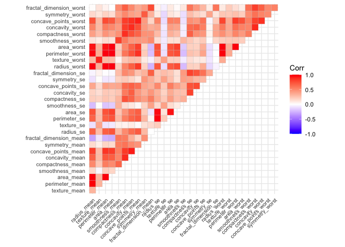
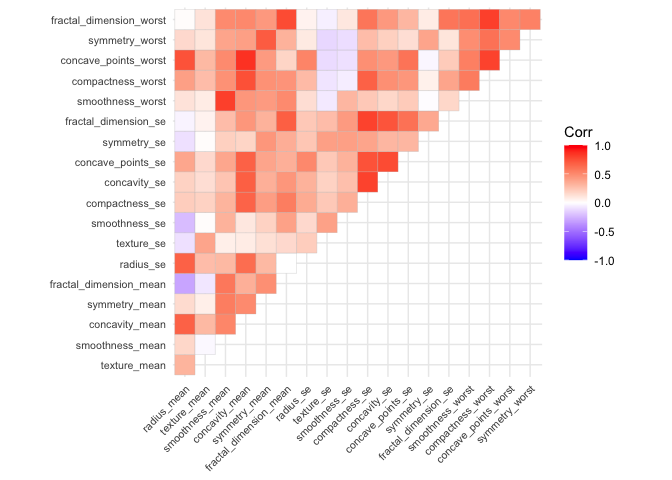
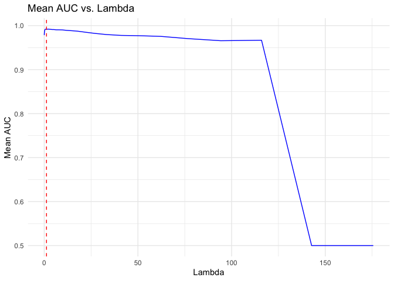

logistic
================
Xinran Sun, Haotian Wu, Lin Yang, Shengzhi Luo
3/17/2022

``` r
ggplot2::theme_set(theme_minimal() + theme(legend.position = "bottom"))
```

## data import and data clean

``` r
#load the data
breast = read.csv("breast-cancer.csv") %>% 
  janitor::clean_names() %>% 
  dplyr::select(-1, -33) %>% #drop id and NA columns
  mutate(diagnosis = recode(diagnosis, "M" = 1, "B" = 0))

#check collinearity
corr = breast[2:31] %>% 
  cor()

ggcorrplot(corr, type = "upper", tl.cex = 8)
```

<!-- -->

``` r
#remove some highly correlated variables
breast_dat <- breast %>% dplyr::select(-area_se, -perimeter_se, -area_worst, -perimeter_mean, -perimeter_worst, -area_mean, -radius_worst, -concave_points_mean, -texture_worst, -compactness_mean, -concavity_worst)

corr1 = breast_dat[2:20] %>% 
  cor()

ggcorrplot(corr1, type = "upper", tl.cex = 8)
```

<!-- -->

``` r
#partition data into training and test data
trainRows <- createDataPartition(y = breast_dat$diagnosis, p = 0.8, list = FALSE)
breast_train <- breast_dat[trainRows, ]
breast_test <-  breast_dat[-trainRows, ]

head(breast_dat, 5)
```

    ##   diagnosis radius_mean texture_mean smoothness_mean concavity_mean
    ## 1         1       17.99        10.38         0.11840         0.3001
    ## 2         1       20.57        17.77         0.08474         0.0869
    ## 3         1       19.69        21.25         0.10960         0.1974
    ## 4         1       11.42        20.38         0.14250         0.2414
    ## 5         1       20.29        14.34         0.10030         0.1980
    ##   symmetry_mean fractal_dimension_mean radius_se texture_se smoothness_se
    ## 1        0.2419                0.07871    1.0950     0.9053      0.006399
    ## 2        0.1812                0.05667    0.5435     0.7339      0.005225
    ## 3        0.2069                0.05999    0.7456     0.7869      0.006150
    ## 4        0.2597                0.09744    0.4956     1.1560      0.009110
    ## 5        0.1809                0.05883    0.7572     0.7813      0.011490
    ##   compactness_se concavity_se concave_points_se symmetry_se
    ## 1        0.04904      0.05373           0.01587     0.03003
    ## 2        0.01308      0.01860           0.01340     0.01389
    ## 3        0.04006      0.03832           0.02058     0.02250
    ## 4        0.07458      0.05661           0.01867     0.05963
    ## 5        0.02461      0.05688           0.01885     0.01756
    ##   fractal_dimension_se smoothness_worst compactness_worst concave_points_worst
    ## 1             0.006193           0.1622            0.6656               0.2654
    ## 2             0.003532           0.1238            0.1866               0.1860
    ## 3             0.004571           0.1444            0.4245               0.2430
    ## 4             0.009208           0.2098            0.8663               0.2575
    ## 5             0.005115           0.1374            0.2050               0.1625
    ##   symmetry_worst fractal_dimension_worst
    ## 1         0.4601                 0.11890
    ## 2         0.2750                 0.08902
    ## 3         0.3613                 0.08758
    ## 4         0.6638                 0.17300
    ## 5         0.2364                 0.07678

``` r
r = dim(breast_dat)[1] #row number
c = dim(breast_dat)[2] #column number

var_names = names(breast_dat)[-c(1,2)] #variable names
  
standardize = function(col) {
  mean = mean(col)
  sd = sd(col)
  return((col - mean)/sd)
}

stand_df = breast_dat %>% 
  dplyr::select(radius_mean:fractal_dimension_worst) %>% 
  map_df(.x = ., standardize) #standardize

X = stand_df #predictors
y = as.vector(ifelse(breast_dat[,2] == "M", 1, 0))#response
```

``` r
x_train <- breast_train[2:20] #predictors
y_train <- breast_train[1] #response
x_train_stan <- cbind(rep(1, nrow(x_train)), scale(x_train))

x_test <- breast_test[2:20]
x_test_stan <- cbind(rep(1, nrow(x_test)), scale(x_test))
```

## Full logistic model

``` r
glm.fit <- glm(diagnosis ~ ., 
               data = breast_dat, 
               subset = trainRows, 
               family = binomial(link = "logit"))
summary(glm.fit)
```

    ## 
    ## Call:
    ## glm(formula = diagnosis ~ ., family = binomial(link = "logit"), 
    ##     data = breast_dat, subset = trainRows)
    ## 
    ## Deviance Residuals: 
    ##      Min        1Q    Median        3Q       Max  
    ## -1.34101  -0.02223  -0.00098   0.00006   2.87137  
    ## 
    ## Coefficients:
    ##                           Estimate Std. Error z value Pr(>|z|)   
    ## (Intercept)               -34.7644    15.4242  -2.254   0.0242 * 
    ## radius_mean                 0.5767     0.4277   1.348   0.1775   
    ## texture_mean                0.4431     0.1544   2.870   0.0041 **
    ## smoothness_mean            61.9215    95.5232   0.648   0.5168   
    ## concavity_mean             81.1436    38.7115   2.096   0.0361 * 
    ## symmetry_mean             -72.9893    41.3502  -1.765   0.0775 . 
    ## fractal_dimension_mean   -331.3924   230.3626  -1.439   0.1503   
    ## radius_se                  23.0239     8.3451   2.759   0.0058 **
    ## texture_se                  0.7323     1.2314   0.595   0.5520   
    ## smoothness_se             272.6570   333.8106   0.817   0.4140   
    ## compactness_se            151.2648   137.9967   1.096   0.2730   
    ## concavity_se              -52.0649    48.9330  -1.064   0.2873   
    ## concave_points_se           6.0420   273.0724   0.022   0.9823   
    ## symmetry_se              -368.3504   163.1970  -2.257   0.0240 * 
    ## fractal_dimension_se    -1876.4700  1180.3567  -1.590   0.1119   
    ## smoothness_worst           -4.4224    66.0627  -0.067   0.9466   
    ## compactness_worst         -30.7426    21.2875  -1.444   0.1487   
    ## concave_points_worst       48.9682    44.7358   1.095   0.2737   
    ## symmetry_worst             67.7242    28.6753   2.362   0.0182 * 
    ## fractal_dimension_worst   264.7268   160.7927   1.646   0.0997 . 
    ## ---
    ## Signif. codes:  0 '***' 0.001 '**' 0.01 '*' 0.05 '.' 0.1 ' ' 1
    ## 
    ## (Dispersion parameter for binomial family taken to be 1)
    ## 
    ##     Null deviance: 608.221  on 455  degrees of freedom
    ## Residual deviance:  45.144  on 436  degrees of freedom
    ## AIC: 85.144
    ## 
    ## Number of Fisher Scoring iterations: 11

``` r
pred <- predict(glm.fit, newdata = breast_test, type = "response")
y_test <- factor(breast_test$diagnosis)
auc_full <- auc(y_test, pred)
auc_full
```

    ## Area under the curve: 0.9971

## Newton-Raphson algorithm

## coordinate-wise optimization of a logistic-lasso model

``` r
#soft threshold
sfxn <- function(beta, lambda) {
  if (abs(beta) > lambda) {
    return(sign(beta) * (abs(beta) - lambda))
  }
  else {
    return(0)
  }
}
```

``` r
#coordinate-wise optimization function
coordwise_lasso <- function(lambda, x, y, betastart, tol = exp(-10), maxiter = 5000) {
  i <- 0
  n <- length(y)
  pnum <- length(betastart)
  betavec <- betastart
  loglik <- 0
  res <- c(0, loglik, betavec)
  prevloglik <- -Inf
  while (i < maxiter & abs(loglik - prevloglik) > tol & loglik < Inf) {
    i <- i + 1
    prevloglik <- loglik
    for (j in 1:pnum) {
      theta <- x %*% betavec
      p <- exp(theta) / (1 + exp(theta)) #probability of malignant cases
      w <- p*(1-p) #working weights
      w <- ifelse(abs(w-0) < 1e-5, 1e-5, w)
      z <- theta + (y - p)/w #working response
      zwoj <- x[, -j] %*% betavec[-j]
      betavec[j] <- sfxn(sum(w*(x[,j])*(z - zwoj)), lambda) / (sum(w*x[,j]*x[,j]))
    }
    theta <- x %*% betavec
    p <- exp(theta) / (1 + exp(theta)) #probability of malignant cases
    w <- p*(1-p) #working weights
    w <- ifelse(abs(w-0) < 1e-10, 1e-10, w)
    z <- theta + (y - p)/w
    loglik <- sum(w*(z - theta)^2) / (2*n) + lambda * sum(abs(betavec))
    res <- rbind(res, c(i, loglik, betavec))
  }
  return(res)
}
#coordwise_res <- coordwise_lasso(lambda = 0.006, x_train_stan, y_train, betastart = rep(0, #20))
#coordwise_res[nrow(coordwise_res), ]
```

We need to calculate lambdamax first to define a sequence of lambda.

``` r
x.matrix <- scale(x_train) %>% as.matrix()
y.matrix <- as.matrix(y_train)
lambdamax <- max(abs(t(x.matrix) %*% y.matrix)) #/ nrow(y.matrix)
lambda_seq1 <- exp(seq(log(lambdamax), -5, length = 50))
lambda_seq2 <- exp(seq(log(lambdamax), -5, length = 50))
```

``` r
#a path of solutions
pathwise <- function(x, y, lambda) {
  n <- length(lambda)
  betastart <- rep(0, 20)
  betas <- NULL
  for (i in 1:n) {
    coordwise_res <- coordwise_lasso(lambda = lambda[i],
                                     x = x,
                                     y = y,
                                     betastart = betastart)
    curbeta <- coordwise_res[nrow(coordwise_res), 3:22]
    betastart <- curbeta
    betas <- rbind(betas, c(curbeta))
  }
  return(data.frame(cbind(lambda, betas)))
}

pathwise_sol <- pathwise(x_train_stan, y_train, lambda_seq2)
pathwise_sol %>% knitr::kable()
```

|      lambda |         V2 |        V3 |        V4 |        V5 |        V6 |         V7 |         V8 |        V9 |       V10 |       V11 |        V12 |        V13 |        V14 |        V15 |        V16 |        V17 |        V18 |       V19 |       V20 |       V21 |
|------------:|-----------:|----------:|----------:|----------:|----------:|-----------:|-----------:|----------:|----------:|----------:|-----------:|-----------:|-----------:|-----------:|-----------:|-----------:|-----------:|----------:|----------:|----------:|
| 175.6200670 |  0.0000000 | 0.0000000 | 0.0000000 | 0.0000000 | 0.0000000 |  0.0000000 |  0.0000000 | 0.0000000 | 0.0000000 | 0.0000000 |  0.0000000 |  0.0000000 |  0.0000000 |  0.0000000 |  0.0000000 |  0.0000000 |  0.0000000 | 0.0000000 | 0.0000000 | 0.0000000 |
| 142.7087951 |  0.0000000 | 0.0000000 | 0.0000000 | 0.0000000 | 0.0000000 |  0.0000000 |  0.0000000 | 0.0000000 | 0.0000000 | 0.0000000 |  0.0000000 |  0.0000000 |  0.0000000 |  0.0000000 |  0.0000000 |  0.0000000 |  0.0000000 | 0.2943165 | 0.0000000 | 0.0000000 |
| 115.9651090 |  0.0000000 | 0.0449507 | 0.0000000 | 0.0000000 | 0.0000000 |  0.0000000 |  0.0000000 | 0.0000000 | 0.0000000 | 0.0000000 |  0.0000000 |  0.0000000 |  0.0000000 |  0.0000000 |  0.0000000 |  0.0000000 |  0.0000000 | 0.5223381 | 0.0000000 | 0.0000000 |
|  94.2332005 |  0.0000000 | 0.1817558 | 0.0000000 | 0.0000000 | 0.0000000 |  0.0000000 |  0.0000000 | 0.0000000 | 0.0000000 | 0.0000000 |  0.0000000 |  0.0000000 |  0.0000000 |  0.0000000 |  0.0000000 |  0.0000000 |  0.0000000 | 0.6681102 | 0.0000000 | 0.0000000 |
|  76.5738605 |  0.0000000 | 0.3201163 | 0.0000000 | 0.0000000 | 0.0000000 |  0.0000000 |  0.0000000 | 0.0000000 | 0.0000000 | 0.0000000 |  0.0000000 |  0.0000000 |  0.0000000 |  0.0000000 |  0.0000000 |  0.0000000 |  0.0000000 | 0.8084582 | 0.0000000 | 0.0000000 |
|  62.2238879 |  0.0000000 | 0.4622675 | 0.0000000 | 0.0000000 | 0.0000000 |  0.0000000 |  0.0000000 | 0.0000000 | 0.0000000 | 0.0000000 |  0.0000000 |  0.0000000 |  0.0000000 |  0.0000000 |  0.0000000 |  0.0000000 |  0.0000000 | 0.9460989 | 0.0000000 | 0.0000000 |
|  50.5631061 |  0.0000000 | 0.6086130 | 0.0000000 | 0.0000000 | 0.0000000 |  0.0000000 |  0.0000000 | 0.0000000 | 0.0000000 | 0.0000000 |  0.0000000 |  0.0000000 |  0.0000000 |  0.0000000 |  0.0000000 |  0.0000000 |  0.0000000 | 1.0828335 | 0.0000000 | 0.0000000 |
|  41.0875595 |  0.0000000 | 0.7441139 | 0.0585916 | 0.0000000 | 0.0000000 |  0.0000000 |  0.0000000 | 0.0000000 | 0.0000000 | 0.0000000 |  0.0000000 |  0.0000000 |  0.0000000 |  0.0000000 |  0.0000000 |  0.0000000 |  0.0000000 | 1.2109501 | 0.0000000 | 0.0000000 |
|  33.3877342 | -0.0790296 | 0.8485077 | 0.1403345 | 0.0000000 | 0.0000000 |  0.0000000 |  0.0000000 | 0.0180659 | 0.0000000 | 0.0000000 |  0.0000000 |  0.0000000 |  0.0000000 |  0.0000000 |  0.0000000 |  0.0000000 |  0.0000000 | 1.3302365 | 0.0000000 | 0.0000000 |
|  27.1308592 | -0.1419478 | 0.9449585 | 0.2155788 | 0.0000000 | 0.0000000 |  0.0000000 |  0.0000000 | 0.1055704 | 0.0000000 | 0.0000000 |  0.0000000 |  0.0000000 |  0.0000000 |  0.0000000 |  0.0000000 |  0.0050039 |  0.0000000 | 1.4065654 | 0.0372075 | 0.0000000 |
|  22.0465252 | -0.1919509 | 1.1045780 | 0.2889273 | 0.0000000 | 0.0000000 |  0.0000000 |  0.0000000 | 0.1910204 | 0.0000000 | 0.0000000 |  0.0000000 |  0.0000000 |  0.0000000 |  0.0000000 |  0.0000000 |  0.0853096 |  0.0000000 | 1.3870361 | 0.1038097 | 0.0000000 |
|  17.9149974 | -0.2354022 | 1.2655194 | 0.3623036 | 0.0000000 | 0.0000000 |  0.0000000 |  0.0000000 | 0.2771301 | 0.0000000 | 0.0000000 |  0.0000000 |  0.0000000 |  0.0000000 |  0.0000000 |  0.0000000 |  0.1633344 |  0.0000000 | 1.3797117 | 0.1670821 | 0.0000000 |
|  14.5577196 | -0.2734518 | 1.4288580 | 0.4360486 | 0.0000000 | 0.0000000 |  0.0000000 |  0.0000000 | 0.3648189 | 0.0000000 | 0.0000000 |  0.0000000 |  0.0000000 |  0.0000000 |  0.0000000 |  0.0000000 |  0.2401183 |  0.0000000 | 1.3822983 | 0.2278130 | 0.0000000 |
|  11.8295971 | -0.3068975 | 1.5951350 | 0.5103109 | 0.0000000 | 0.0000000 |  0.0000000 |  0.0000000 | 0.4549222 | 0.0000000 | 0.0000000 |  0.0000000 |  0.0000000 |  0.0000000 |  0.0000000 |  0.0000000 |  0.3162774 |  0.0000000 | 1.3932814 | 0.2864016 | 0.0000000 |
|   9.6127258 | -0.3363397 | 1.7644595 | 0.5851153 | 0.0000000 | 0.0000000 |  0.0000000 |  0.0000000 | 0.5480481 | 0.0000000 | 0.0000000 |  0.0000000 |  0.0000000 |  0.0000000 |  0.0000000 |  0.0000000 |  0.3921529 |  0.0000000 | 1.4116344 | 0.3429920 | 0.0000000 |
|   7.8112971 | -0.3622844 | 1.9365458 | 0.6603889 | 0.0000000 | 0.0000000 |  0.0000000 |  0.0000000 | 0.6444913 | 0.0000000 | 0.0000000 |  0.0000000 |  0.0000000 |  0.0000000 |  0.0000000 |  0.0000000 |  0.4678661 |  0.0000000 | 1.4366324 | 0.3975661 | 0.0000000 |
|   6.3474568 | -0.3741815 | 2.0427365 | 0.7336044 | 0.0000000 | 0.0000000 |  0.0000000 |  0.0000000 | 0.8101351 | 0.0000000 | 0.0000000 |  0.0000000 |  0.0000000 |  0.0000000 |  0.0000000 | -0.0564491 |  0.5192931 |  0.0000000 | 1.5189520 | 0.4437527 | 0.0000000 |
|   5.1579408 | -0.3809999 | 2.1444487 | 0.8071971 | 0.0000000 | 0.0000000 |  0.0000000 |  0.0000000 | 0.9927716 | 0.0000000 | 0.0000000 |  0.0000000 |  0.0000000 |  0.0000000 |  0.0000000 | -0.1243371 |  0.5680337 |  0.0000000 | 1.6134143 | 0.4869455 | 0.0000000 |
|   4.1913406 | -0.3794226 | 2.2224281 | 0.8807832 | 0.0000000 | 0.0573917 |  0.0000000 | -0.0339437 | 1.1787410 | 0.0000000 | 0.0000000 | -0.0870009 |  0.0000000 |  0.0000000 |  0.0000000 | -0.1374247 |  0.6156753 |  0.0000000 | 1.7179081 | 0.5339830 | 0.0000000 |
|   3.4058817 | -0.3671434 | 2.2421257 | 0.9473299 | 0.0000000 | 0.2853304 |  0.0000000 | -0.1386127 | 1.3956766 | 0.0000000 | 0.0000000 | -0.2022721 |  0.0000000 |  0.0000000 | -0.0897915 | -0.1237281 |  0.6756868 |  0.0000000 | 1.7135988 | 0.6202057 | 0.0000000 |
|   2.7676181 | -0.3577483 | 2.2667728 | 1.0147006 | 0.0000000 | 0.5182348 |  0.0000000 | -0.2374139 | 1.6425204 | 0.0000000 | 0.0000000 | -0.2676399 |  0.0000000 |  0.0000000 | -0.2434972 | -0.1322599 |  0.7361070 |  0.0000000 | 1.6741161 | 0.7292870 | 0.0000000 |
|   2.2489653 | -0.3494675 | 2.3067432 | 1.0848144 | 0.0000000 | 0.7429182 |  0.0000000 | -0.3266410 | 1.8862004 | 0.0000000 | 0.0000000 | -0.3134799 |  0.0000000 |  0.0000000 | -0.3971108 | -0.1575549 |  0.7968590 |  0.0000000 | 1.6415594 | 0.8391941 | 0.0000000 |
|   1.8275083 | -0.3419227 | 2.3579303 | 1.1571380 | 0.0000000 | 0.9607409 |  0.0000000 | -0.4065173 | 2.1270281 | 0.0000000 | 0.0000000 | -0.3439414 |  0.0000000 |  0.0000000 | -0.5510662 | -0.1956384 |  0.8565704 |  0.0000000 | 1.6153575 | 0.9497651 | 0.0000000 |
|   1.4850325 | -0.3252445 | 2.3932753 | 1.2216509 | 0.0000000 | 1.1721672 | -0.0811699 | -0.4664228 | 2.4032299 | 0.0000000 | 0.0000000 | -0.3623942 |  0.0000000 |  0.0000000 | -0.6898708 | -0.2455905 |  0.9142763 |  0.0000000 | 1.6112744 | 1.0882818 | 0.0000000 |
|   1.2067368 | -0.3042552 | 2.4235362 | 1.2844345 | 0.0000000 | 1.3729386 | -0.1702373 | -0.5255657 | 2.6867872 | 0.0000000 | 0.0000000 | -0.3729148 |  0.0000000 | -0.0168540 | -0.8202033 | -0.2890151 |  0.9694531 |  0.0000000 | 1.6331962 | 1.2223326 | 0.0000000 |
|   0.9805938 | -0.2805297 | 2.4539685 | 1.3473532 | 0.0000000 | 1.5659248 | -0.2529630 | -0.5818889 | 2.9717354 | 0.0000000 | 0.0000000 | -0.3764319 |  0.0000000 | -0.0449577 | -0.9476088 | -0.3300626 |  1.0208703 |  0.0000000 | 1.6702153 | 1.3487178 | 0.0000000 |
|   0.7968302 | -0.2561658 | 2.4860859 | 1.4102042 | 0.0000000 | 1.7492205 | -0.3318600 | -0.6329763 | 3.2544571 | 0.0000000 | 0.0000000 | -0.3761045 |  0.0000000 | -0.0723917 | -1.0734659 | -0.3730088 |  1.0681041 |  0.0000000 | 1.7144609 | 1.4727481 | 0.0000000 |
|   0.6475039 | -0.2300652 | 2.5214870 | 1.4704688 | 0.0000000 | 1.9258584 | -0.4044486 | -0.6919089 | 3.5343556 | 0.0000000 | 0.0000000 | -0.3793378 |  0.0000000 | -0.0856147 | -1.1907728 | -0.4290118 |  1.1103127 |  0.0000000 | 1.7445538 | 1.5853708 | 0.0318904 |
|   0.5261614 | -0.1977978 | 2.5516145 | 1.5211945 | 0.0000000 | 2.1302284 | -0.4702635 | -0.7897550 | 3.8104868 | 0.0000000 | 0.0000000 | -0.3984807 | -0.0213529 | -0.0433621 | -1.2893969 | -0.5195443 |  1.1416593 |  0.0000000 | 1.7020780 | 1.6766629 | 0.1631937 |
|   0.4275585 | -0.1767427 | 2.5717326 | 1.5589585 | 0.0719770 | 2.3359899 | -0.5610296 | -0.9256109 | 4.0498103 | 0.0325616 | 0.0000000 | -0.4256383 | -0.0423422 |  0.0000000 | -1.3930366 | -0.6063571 |  1.1206702 |  0.0000000 | 1.6637208 | 1.7885078 | 0.3175087 |
|   0.3474339 | -0.1673955 | 2.5906426 | 1.5950435 | 0.2027129 | 2.5088324 | -0.6608951 | -1.0797264 | 4.2648613 | 0.0798514 | 0.0000000 | -0.4515944 | -0.0364145 |  0.0000000 | -1.4978415 | -0.6753061 |  1.0649000 |  0.0000000 | 1.6726969 | 1.9028826 | 0.4576371 |
|   0.2823246 | -0.1586755 | 2.6097570 | 1.6305700 | 0.3225398 | 2.6740473 | -0.7540684 | -1.2224305 | 4.4712488 | 0.1218289 | 0.0000000 | -0.4740722 | -0.0320952 |  0.0000000 | -1.5962568 | -0.7434644 |  1.0146868 |  0.0000000 | 1.6853482 | 2.0112132 | 0.5872520 |
|   0.2294169 | -0.1317058 | 2.5976346 | 1.6586099 | 0.4056445 | 2.9055327 | -0.8564331 | -1.3400140 | 4.6590686 | 0.1555915 | 0.0000000 | -0.3605075 | -0.0940562 |  0.0000000 | -1.7076059 | -0.8702118 |  0.9630388 | -0.2229467 | 1.7639376 | 2.1519211 | 0.7922668 |
|   0.1864241 | -0.0838063 | 2.5482823 | 1.6790833 | 0.4542062 | 3.2292747 | -0.9721815 | -1.4334571 | 4.8356136 | 0.1809948 | 0.0192051 | -0.0737472 | -0.2371863 |  0.0000000 | -1.8356055 | -1.1256609 |  0.8917239 | -0.7023750 | 1.9129828 | 2.3281749 | 1.1179861 |
|   0.1514881 | -0.0464788 | 2.5394859 | 1.6874475 | 0.5375819 | 3.4859223 | -1.0585727 | -1.5596045 | 4.9918663 | 0.2227277 | 0.0981144 |  0.0000000 | -0.3060842 |  0.0000000 | -1.9011997 | -1.3683131 |  0.7673335 | -0.9169094 | 1.9891398 | 2.4498027 | 1.4389675 |
|   0.1230992 | -0.0167293 | 2.5476232 | 1.6953327 | 0.6203052 | 3.6923645 | -1.1324517 | -1.6837949 | 5.1366758 | 0.2653519 | 0.1693705 |  0.0000000 | -0.3432173 |  0.0000000 | -1.9482167 | -1.5494442 |  0.6590458 | -1.0285935 | 2.0410664 | 2.5506187 | 1.6996046 |
|   0.1000303 |  0.0000000 | 2.5540110 | 1.7048146 | 0.7024613 | 3.8727780 | -1.2012445 | -1.8013921 | 5.2630426 | 0.3040462 | 0.2317371 |  0.0008297 | -0.3723133 |  0.0000000 | -1.9970716 | -1.7096195 |  0.5611635 | -1.1182987 | 2.0879510 | 2.6476584 | 1.9219511 |
|   0.0812846 |  0.0000000 | 2.4837547 | 1.7235558 | 0.7807395 | 4.1677952 | -1.2921646 | -1.8943589 | 5.3680978 | 0.3153993 | 0.3249247 |  0.3788685 | -0.5152626 |  0.0000000 | -2.1135999 | -2.1877270 |  0.4199305 | -1.5948491 | 2.2211820 | 2.7904120 | 2.3282866 |
|   0.0660518 |  0.0269748 | 2.4192610 | 1.7410789 | 0.8228062 | 4.4755152 | -1.3815474 | -1.9611862 | 5.5018222 | 0.3242477 | 0.4084179 |  0.7520503 | -0.6704181 |  0.0000000 | -2.2261600 | -2.6373300 |  0.3102094 | -2.0832160 | 2.3575852 | 2.9342306 | 2.7130343 |
|   0.0536737 |  0.0743422 | 2.3641115 | 1.7566525 | 0.8396578 | 4.7773353 | -1.4666400 | -2.0122915 | 5.6612723 | 0.3354405 | 0.4798476 |  1.0618901 | -0.8179845 |  0.0000000 | -2.3310843 | -3.0113283 |  0.2280463 | -2.5093263 | 2.4810710 | 3.0747379 | 3.0416591 |
|   0.0436152 |  0.0950184 | 2.3523161 | 1.7661018 | 0.8551320 | 4.8773225 | -1.5221486 | -2.0556221 | 5.7738055 | 0.3552511 | 0.4928868 |  1.0822269 | -0.8508756 |  0.0000000 | -2.3781777 | -3.0547782 |  0.2127563 | -2.5639803 | 2.5378582 | 3.1557929 | 3.0968592 |
|   0.0354417 |  0.1556815 | 2.2785291 | 1.7877446 | 0.8602352 | 5.2818845 | -1.6097695 | -2.0980726 | 5.9404992 | 0.3554510 | 0.5919255 |  1.5710836 | -1.0614049 |  0.0000000 | -2.5097232 | -3.6200138 |  0.1092045 | -3.2137454 | 2.6956155 | 3.3127135 | 3.5744685 |
|   0.0287999 |  0.1895256 | 2.2459124 | 1.8019945 | 0.8665308 | 5.4873878 | -1.6683679 | -2.1337206 | 6.0586215 | 0.3644394 | 0.6350989 |  1.7725819 | -1.1588228 |  0.0000000 | -2.5835372 | -3.8600922 |  0.0667363 | -3.4946213 | 2.7850043 | 3.4107574 | 3.7844589 |
|   0.0234028 |  0.2189224 | 2.2188213 | 1.8148663 | 0.8713700 | 5.6642026 | -1.7189652 | -2.1650592 | 6.1622576 | 0.3727548 | 0.6712149 |  1.9417703 | -1.2415488 |  0.0000000 | -2.6474833 | -4.0620780 |  0.0324955 | -3.7317882 | 2.8623635 | 3.4957080 | 3.9613322 |
|   0.0190171 |  0.2281755 | 2.2151803 | 1.8198887 | 0.8755911 | 5.7031129 | -1.7440709 | -2.1831795 | 6.2156726 | 0.3817922 | 0.6746368 |  1.9465038 | -1.2537950 |  0.0000000 | -2.6673760 | -4.0746511 |  0.0309898 | -3.7497848 | 2.8906730 | 3.5309812 | 3.9784010 |
|   0.0154533 |  0.2674254 | 2.1817188 | 1.8360533 | 0.8673046 | 5.9342009 | -1.7965825 | -2.2113248 | 6.3293311 | 0.3857506 | 0.7197108 |  2.2005695 | -1.3681039 |  0.0000000 | -2.7474464 | -4.3584545 |  0.0000000 | -4.0978232 | 2.9833535 | 3.6271298 | 4.2222161 |
|   0.0125573 |  0.2873847 | 2.1704413 | 1.8444518 | 0.8585663 | 6.0327827 | -1.8250393 | -2.2268479 | 6.3950129 | 0.3903243 | 0.7336166 |  2.2979263 | -1.4150989 |  0.0000000 | -2.7852833 | -4.4614594 |  0.0000000 | -4.2368743 | 3.0290789 | 3.6759288 | 4.3137703 |
|   0.0102041 |  0.2952932 | 2.1675338 | 1.8477877 | 0.8603882 | 6.0705470 | -1.8424393 | -2.2411618 | 6.4333288 | 0.3967112 | 0.7373174 |  2.3066671 | -1.4279284 |  0.0026953 | -2.8020594 | -4.4785183 | -0.0008674 | -4.2580686 | 3.0432701 | 3.7031774 | 4.3344893 |
|   0.0082918 |  0.2958047 | 2.1688188 | 1.8490666 | 0.8613992 | 6.0736177 | -1.8446308 | -2.2424321 | 6.4385717 | 0.3971121 | 0.7368905 |  2.3082297 | -1.4294745 |  0.0034912 | -2.8036676 | -4.4808275 | -0.0007829 | -4.2594170 | 3.0475062 | 3.7051768 | 4.3360161 |
|   0.0067379 |  0.3240544 | 2.1389531 | 1.8627234 | 0.8663913 | 6.2723051 | -1.8942721 | -2.2765757 | 6.5329550 | 0.4035093 | 0.7744387 |  2.5051237 | -1.5256283 |  0.0191475 | -2.8707494 | -4.7213754 | -0.0382754 | -4.5308859 | 3.1094350 | 3.7914155 | 4.5463088 |

## cross-validation

``` r
set.seed(2022)

cv = function(data, lambda) {
  n <- nrow(data)
  data <- data[sample(n), ] #shuffle the data
  folds <- cut(seq(1, nrow(data)), breaks = 5, labels = FALSE) #Create 5 equal size folds
 # mse <- data.frame() #a data frame storing mse results
  #mse_lambda <- vector()
  #se <- vector() #a vector storing test errors
  res <- lambda 
  #se <- vector() #a vectro storing test errors
  
    #Perform 5 fold cross validation
  for (i in 1:5) {
    #partition the data into train and test data
    testRows <- which(folds == i, arr.ind = TRUE)
    data_test <- data[testRows, ]
    data_train <- data[-testRows, ]
    x_train <- data_train[2:20]
    x_train_stan <- cbind(rep(1, nrow(x_train)), scale(x_train))
    y_train <- data_train[1]
    x_test <- data_test[2:20]
    #standardized test data
    x_test_stan <- cbind(rep(1, nrow(x_test)), scale(x_test))
    y_test <- data_test %>% mutate(diagnosis = factor(diagnosis))
    y_test <- y_test$diagnosis
    #Use the test and train data partitions to perform lasso
    path_sol <- pathwise(x = x_train_stan,
                         y = y_train,
                         lambda = lambda)
    auc <- vector()
    for (j in 1:length(lambda)) {
      curbeta <- as.numeric(path_sol[j, 2:21])
      theta <- x_test_stan %*% curbeta
      p <- exp(theta) / (1 + exp(theta)) 
      auc[j] <- auc(y_test, p)
      #y.pred <- ifelse(p > 0.5, 1, 0)
      #accuracy[j] <- mean(y.pred == y_test)
    }
    print(auc)
    res <- cbind(res, auc)
    print(res)
  }
  return(res)
    #se[j] <- sqrt(var(error)/5)
  #cv.auc.lambda <- rowMeans(mse)
  #return(cv.auc.lambda)
}

cv_test = cv(data = breast_train, lambda_seq2)
```

    ##  [1] 0.5000000 0.5000000 0.9876733 0.9876733 0.9938367 0.9948639 0.9948639
    ##  [8] 0.9948639 0.9958911 0.9958911 0.9969183 0.9974319 0.9974319 0.9974319
    ## [15] 0.9969183 0.9964047 0.9958911 0.9964047 0.9964047 0.9964047 0.9964047
    ## [22] 0.9964047 0.9964047 0.9964047 0.9958911 0.9958911 0.9958911 0.9953775
    ## [29] 0.9953775 0.9953775 0.9943503 0.9933231 0.9922958 0.9917822 0.9912686
    ## [36] 0.9912686 0.9907550 0.9897278 0.9897278 0.9892142 0.9892142 0.9887006
    ## [43] 0.9887006 0.9887006 0.9887006 0.9871597 0.9871597 0.9866461 0.9861325
    ## [50] 0.9866461
    ##                res       auc
    ##  [1,] 1.756201e+02 0.5000000
    ##  [2,] 1.427088e+02 0.5000000
    ##  [3,] 1.159651e+02 0.9876733
    ##  [4,] 9.423320e+01 0.9876733
    ##  [5,] 7.657386e+01 0.9938367
    ##  [6,] 6.222389e+01 0.9948639
    ##  [7,] 5.056311e+01 0.9948639
    ##  [8,] 4.108756e+01 0.9948639
    ##  [9,] 3.338773e+01 0.9958911
    ## [10,] 2.713086e+01 0.9958911
    ## [11,] 2.204653e+01 0.9969183
    ## [12,] 1.791500e+01 0.9974319
    ## [13,] 1.455772e+01 0.9974319
    ## [14,] 1.182960e+01 0.9974319
    ## [15,] 9.612726e+00 0.9969183
    ## [16,] 7.811297e+00 0.9964047
    ## [17,] 6.347457e+00 0.9958911
    ## [18,] 5.157941e+00 0.9964047
    ## [19,] 4.191341e+00 0.9964047
    ## [20,] 3.405882e+00 0.9964047
    ## [21,] 2.767618e+00 0.9964047
    ## [22,] 2.248965e+00 0.9964047
    ## [23,] 1.827508e+00 0.9964047
    ## [24,] 1.485033e+00 0.9964047
    ## [25,] 1.206737e+00 0.9958911
    ## [26,] 9.805938e-01 0.9958911
    ## [27,] 7.968302e-01 0.9958911
    ## [28,] 6.475039e-01 0.9953775
    ## [29,] 5.261614e-01 0.9953775
    ## [30,] 4.275585e-01 0.9953775
    ## [31,] 3.474339e-01 0.9943503
    ## [32,] 2.823246e-01 0.9933231
    ## [33,] 2.294169e-01 0.9922958
    ## [34,] 1.864241e-01 0.9917822
    ## [35,] 1.514881e-01 0.9912686
    ## [36,] 1.230992e-01 0.9912686
    ## [37,] 1.000303e-01 0.9907550
    ## [38,] 8.128462e-02 0.9897278
    ## [39,] 6.605185e-02 0.9897278
    ## [40,] 5.367371e-02 0.9892142
    ## [41,] 4.361523e-02 0.9892142
    ## [42,] 3.544172e-02 0.9887006
    ## [43,] 2.879993e-02 0.9887006
    ## [44,] 2.340281e-02 0.9887006
    ## [45,] 1.901711e-02 0.9887006
    ## [46,] 1.545330e-02 0.9871597
    ## [47,] 1.255734e-02 0.9871597
    ## [48,] 1.020409e-02 0.9866461
    ## [49,] 8.291841e-03 0.9861325
    ## [50,] 6.737947e-03 0.9866461
    ##  [1] 0.5000000 0.5000000 0.9875283 0.9801587 0.9767574 0.9739229 0.9716553
    ##  [8] 0.9705215 0.9716553 0.9739229 0.9739229 0.9767574 0.9790249 0.9835601
    ## [15] 0.9875283 0.9880952 0.9886621 0.9892290 0.9903628 0.9909297 0.9909297
    ## [22] 0.9920635 0.9914966 0.9909297 0.9931973 0.9937642 0.9926304 0.9926304
    ## [29] 0.9931973 0.9931973 0.9937642 0.9937642 0.9937642 0.9937642 0.9931973
    ## [36] 0.9931973 0.9926304 0.9926304 0.9920635 0.9931973 0.9931973 0.9926304
    ## [43] 0.9914966 0.9914966 0.9914966 0.9914966 0.9914966 0.9914966 0.9914966
    ## [50] 0.9914966
    ##                res       auc       auc
    ##  [1,] 1.756201e+02 0.5000000 0.5000000
    ##  [2,] 1.427088e+02 0.5000000 0.5000000
    ##  [3,] 1.159651e+02 0.9876733 0.9875283
    ##  [4,] 9.423320e+01 0.9876733 0.9801587
    ##  [5,] 7.657386e+01 0.9938367 0.9767574
    ##  [6,] 6.222389e+01 0.9948639 0.9739229
    ##  [7,] 5.056311e+01 0.9948639 0.9716553
    ##  [8,] 4.108756e+01 0.9948639 0.9705215
    ##  [9,] 3.338773e+01 0.9958911 0.9716553
    ## [10,] 2.713086e+01 0.9958911 0.9739229
    ## [11,] 2.204653e+01 0.9969183 0.9739229
    ## [12,] 1.791500e+01 0.9974319 0.9767574
    ## [13,] 1.455772e+01 0.9974319 0.9790249
    ## [14,] 1.182960e+01 0.9974319 0.9835601
    ## [15,] 9.612726e+00 0.9969183 0.9875283
    ## [16,] 7.811297e+00 0.9964047 0.9880952
    ## [17,] 6.347457e+00 0.9958911 0.9886621
    ## [18,] 5.157941e+00 0.9964047 0.9892290
    ## [19,] 4.191341e+00 0.9964047 0.9903628
    ## [20,] 3.405882e+00 0.9964047 0.9909297
    ## [21,] 2.767618e+00 0.9964047 0.9909297
    ## [22,] 2.248965e+00 0.9964047 0.9920635
    ## [23,] 1.827508e+00 0.9964047 0.9914966
    ## [24,] 1.485033e+00 0.9964047 0.9909297
    ## [25,] 1.206737e+00 0.9958911 0.9931973
    ## [26,] 9.805938e-01 0.9958911 0.9937642
    ## [27,] 7.968302e-01 0.9958911 0.9926304
    ## [28,] 6.475039e-01 0.9953775 0.9926304
    ## [29,] 5.261614e-01 0.9953775 0.9931973
    ## [30,] 4.275585e-01 0.9953775 0.9931973
    ## [31,] 3.474339e-01 0.9943503 0.9937642
    ## [32,] 2.823246e-01 0.9933231 0.9937642
    ## [33,] 2.294169e-01 0.9922958 0.9937642
    ## [34,] 1.864241e-01 0.9917822 0.9937642
    ## [35,] 1.514881e-01 0.9912686 0.9931973
    ## [36,] 1.230992e-01 0.9912686 0.9931973
    ## [37,] 1.000303e-01 0.9907550 0.9926304
    ## [38,] 8.128462e-02 0.9897278 0.9926304
    ## [39,] 6.605185e-02 0.9897278 0.9920635
    ## [40,] 5.367371e-02 0.9892142 0.9931973
    ## [41,] 4.361523e-02 0.9892142 0.9931973
    ## [42,] 3.544172e-02 0.9887006 0.9926304
    ## [43,] 2.879993e-02 0.9887006 0.9914966
    ## [44,] 2.340281e-02 0.9887006 0.9914966
    ## [45,] 1.901711e-02 0.9887006 0.9914966
    ## [46,] 1.545330e-02 0.9871597 0.9914966
    ## [47,] 1.255734e-02 0.9871597 0.9914966
    ## [48,] 1.020409e-02 0.9866461 0.9914966
    ## [49,] 8.291841e-03 0.9861325 0.9914966
    ## [50,] 6.737947e-03 0.9866461 0.9914966
    ##  [1] 0.5000000 0.5000000 0.9819820 0.9829830 0.9864865 0.9879880 0.9874875
    ##  [8] 0.9879880 0.9884885 0.9904905 0.9934935 0.9974975 0.9979980 0.9979980
    ## [15] 0.9979980 0.9984985 0.9984985 0.9994995 0.9989990 0.9989990 0.9989990
    ## [22] 0.9994995 0.9994995 0.9994995 0.9994995 0.9994995 0.9994995 0.9994995
    ## [29] 0.9994995 0.9994995 0.9994995 0.9994995 0.9994995 0.9989990 0.9989990
    ## [36] 0.9989990 0.9989990 0.9989990 0.9989990 0.9989990 0.9989990 0.9984985
    ## [43] 0.9984985 0.9979980 0.9979980 0.9979980 0.9979980 0.9979980 0.9979980
    ## [50] 0.9979980
    ##                res       auc       auc       auc
    ##  [1,] 1.756201e+02 0.5000000 0.5000000 0.5000000
    ##  [2,] 1.427088e+02 0.5000000 0.5000000 0.5000000
    ##  [3,] 1.159651e+02 0.9876733 0.9875283 0.9819820
    ##  [4,] 9.423320e+01 0.9876733 0.9801587 0.9829830
    ##  [5,] 7.657386e+01 0.9938367 0.9767574 0.9864865
    ##  [6,] 6.222389e+01 0.9948639 0.9739229 0.9879880
    ##  [7,] 5.056311e+01 0.9948639 0.9716553 0.9874875
    ##  [8,] 4.108756e+01 0.9948639 0.9705215 0.9879880
    ##  [9,] 3.338773e+01 0.9958911 0.9716553 0.9884885
    ## [10,] 2.713086e+01 0.9958911 0.9739229 0.9904905
    ## [11,] 2.204653e+01 0.9969183 0.9739229 0.9934935
    ## [12,] 1.791500e+01 0.9974319 0.9767574 0.9974975
    ## [13,] 1.455772e+01 0.9974319 0.9790249 0.9979980
    ## [14,] 1.182960e+01 0.9974319 0.9835601 0.9979980
    ## [15,] 9.612726e+00 0.9969183 0.9875283 0.9979980
    ## [16,] 7.811297e+00 0.9964047 0.9880952 0.9984985
    ## [17,] 6.347457e+00 0.9958911 0.9886621 0.9984985
    ## [18,] 5.157941e+00 0.9964047 0.9892290 0.9994995
    ## [19,] 4.191341e+00 0.9964047 0.9903628 0.9989990
    ## [20,] 3.405882e+00 0.9964047 0.9909297 0.9989990
    ## [21,] 2.767618e+00 0.9964047 0.9909297 0.9989990
    ## [22,] 2.248965e+00 0.9964047 0.9920635 0.9994995
    ## [23,] 1.827508e+00 0.9964047 0.9914966 0.9994995
    ## [24,] 1.485033e+00 0.9964047 0.9909297 0.9994995
    ## [25,] 1.206737e+00 0.9958911 0.9931973 0.9994995
    ## [26,] 9.805938e-01 0.9958911 0.9937642 0.9994995
    ## [27,] 7.968302e-01 0.9958911 0.9926304 0.9994995
    ## [28,] 6.475039e-01 0.9953775 0.9926304 0.9994995
    ## [29,] 5.261614e-01 0.9953775 0.9931973 0.9994995
    ## [30,] 4.275585e-01 0.9953775 0.9931973 0.9994995
    ## [31,] 3.474339e-01 0.9943503 0.9937642 0.9994995
    ## [32,] 2.823246e-01 0.9933231 0.9937642 0.9994995
    ## [33,] 2.294169e-01 0.9922958 0.9937642 0.9994995
    ## [34,] 1.864241e-01 0.9917822 0.9937642 0.9989990
    ## [35,] 1.514881e-01 0.9912686 0.9931973 0.9989990
    ## [36,] 1.230992e-01 0.9912686 0.9931973 0.9989990
    ## [37,] 1.000303e-01 0.9907550 0.9926304 0.9989990
    ## [38,] 8.128462e-02 0.9897278 0.9926304 0.9989990
    ## [39,] 6.605185e-02 0.9897278 0.9920635 0.9989990
    ## [40,] 5.367371e-02 0.9892142 0.9931973 0.9989990
    ## [41,] 4.361523e-02 0.9892142 0.9931973 0.9989990
    ## [42,] 3.544172e-02 0.9887006 0.9926304 0.9984985
    ## [43,] 2.879993e-02 0.9887006 0.9914966 0.9984985
    ## [44,] 2.340281e-02 0.9887006 0.9914966 0.9979980
    ## [45,] 1.901711e-02 0.9887006 0.9914966 0.9979980
    ## [46,] 1.545330e-02 0.9871597 0.9914966 0.9979980
    ## [47,] 1.255734e-02 0.9871597 0.9914966 0.9979980
    ## [48,] 1.020409e-02 0.9866461 0.9914966 0.9979980
    ## [49,] 8.291841e-03 0.9861325 0.9914966 0.9979980
    ## [50,] 6.737947e-03 0.9866461 0.9914966 0.9979980
    ##  [1] 0.5000000 0.5000000 0.9379345 0.9389275 0.9503476 0.9572989 0.9602781
    ##  [8] 0.9617676 0.9647468 0.9707051 0.9741807 0.9776564 0.9776564 0.9766634
    ## [15] 0.9766634 0.9766634 0.9766634 0.9766634 0.9766634 0.9776564 0.9776564
    ## [22] 0.9776564 0.9786495 0.9801390 0.9821251 0.9816286 0.9816286 0.9816286
    ## [29] 0.9816286 0.9811321 0.9806356 0.9791460 0.9791460 0.9791460 0.9781529
    ## [36] 0.9776564 0.9761668 0.9746773 0.9731877 0.9726912 0.9721946 0.9712016
    ## [43] 0.9702085 0.9697120 0.9697120 0.9682224 0.9657398 0.9652433 0.9652433
    ## [50] 0.9652433
    ##                res       auc       auc       auc       auc
    ##  [1,] 1.756201e+02 0.5000000 0.5000000 0.5000000 0.5000000
    ##  [2,] 1.427088e+02 0.5000000 0.5000000 0.5000000 0.5000000
    ##  [3,] 1.159651e+02 0.9876733 0.9875283 0.9819820 0.9379345
    ##  [4,] 9.423320e+01 0.9876733 0.9801587 0.9829830 0.9389275
    ##  [5,] 7.657386e+01 0.9938367 0.9767574 0.9864865 0.9503476
    ##  [6,] 6.222389e+01 0.9948639 0.9739229 0.9879880 0.9572989
    ##  [7,] 5.056311e+01 0.9948639 0.9716553 0.9874875 0.9602781
    ##  [8,] 4.108756e+01 0.9948639 0.9705215 0.9879880 0.9617676
    ##  [9,] 3.338773e+01 0.9958911 0.9716553 0.9884885 0.9647468
    ## [10,] 2.713086e+01 0.9958911 0.9739229 0.9904905 0.9707051
    ## [11,] 2.204653e+01 0.9969183 0.9739229 0.9934935 0.9741807
    ## [12,] 1.791500e+01 0.9974319 0.9767574 0.9974975 0.9776564
    ## [13,] 1.455772e+01 0.9974319 0.9790249 0.9979980 0.9776564
    ## [14,] 1.182960e+01 0.9974319 0.9835601 0.9979980 0.9766634
    ## [15,] 9.612726e+00 0.9969183 0.9875283 0.9979980 0.9766634
    ## [16,] 7.811297e+00 0.9964047 0.9880952 0.9984985 0.9766634
    ## [17,] 6.347457e+00 0.9958911 0.9886621 0.9984985 0.9766634
    ## [18,] 5.157941e+00 0.9964047 0.9892290 0.9994995 0.9766634
    ## [19,] 4.191341e+00 0.9964047 0.9903628 0.9989990 0.9766634
    ## [20,] 3.405882e+00 0.9964047 0.9909297 0.9989990 0.9776564
    ## [21,] 2.767618e+00 0.9964047 0.9909297 0.9989990 0.9776564
    ## [22,] 2.248965e+00 0.9964047 0.9920635 0.9994995 0.9776564
    ## [23,] 1.827508e+00 0.9964047 0.9914966 0.9994995 0.9786495
    ## [24,] 1.485033e+00 0.9964047 0.9909297 0.9994995 0.9801390
    ## [25,] 1.206737e+00 0.9958911 0.9931973 0.9994995 0.9821251
    ## [26,] 9.805938e-01 0.9958911 0.9937642 0.9994995 0.9816286
    ## [27,] 7.968302e-01 0.9958911 0.9926304 0.9994995 0.9816286
    ## [28,] 6.475039e-01 0.9953775 0.9926304 0.9994995 0.9816286
    ## [29,] 5.261614e-01 0.9953775 0.9931973 0.9994995 0.9816286
    ## [30,] 4.275585e-01 0.9953775 0.9931973 0.9994995 0.9811321
    ## [31,] 3.474339e-01 0.9943503 0.9937642 0.9994995 0.9806356
    ## [32,] 2.823246e-01 0.9933231 0.9937642 0.9994995 0.9791460
    ## [33,] 2.294169e-01 0.9922958 0.9937642 0.9994995 0.9791460
    ## [34,] 1.864241e-01 0.9917822 0.9937642 0.9989990 0.9791460
    ## [35,] 1.514881e-01 0.9912686 0.9931973 0.9989990 0.9781529
    ## [36,] 1.230992e-01 0.9912686 0.9931973 0.9989990 0.9776564
    ## [37,] 1.000303e-01 0.9907550 0.9926304 0.9989990 0.9761668
    ## [38,] 8.128462e-02 0.9897278 0.9926304 0.9989990 0.9746773
    ## [39,] 6.605185e-02 0.9897278 0.9920635 0.9989990 0.9731877
    ## [40,] 5.367371e-02 0.9892142 0.9931973 0.9989990 0.9726912
    ## [41,] 4.361523e-02 0.9892142 0.9931973 0.9989990 0.9721946
    ## [42,] 3.544172e-02 0.9887006 0.9926304 0.9984985 0.9712016
    ## [43,] 2.879993e-02 0.9887006 0.9914966 0.9984985 0.9702085
    ## [44,] 2.340281e-02 0.9887006 0.9914966 0.9979980 0.9697120
    ## [45,] 1.901711e-02 0.9887006 0.9914966 0.9979980 0.9697120
    ## [46,] 1.545330e-02 0.9871597 0.9914966 0.9979980 0.9682224
    ## [47,] 1.255734e-02 0.9871597 0.9914966 0.9979980 0.9657398
    ## [48,] 1.020409e-02 0.9866461 0.9914966 0.9979980 0.9652433
    ## [49,] 8.291841e-03 0.9861325 0.9914966 0.9979980 0.9652433
    ## [50,] 6.737947e-03 0.9866461 0.9914966 0.9979980 0.9652433
    ##  [1] 0.5000000 0.5000000 0.9387255 0.9387255 0.9450980 0.9637255 0.9710784
    ##  [8] 0.9735294 0.9774510 0.9803922 0.9862745 0.9872549 0.9901961 0.9906863
    ## [15] 0.9921569 0.9926471 0.9926471 0.9936275 0.9931373 0.9936275 0.9946078
    ## [22] 0.9946078 0.9931373 0.9921569 0.9916667 0.9901961 0.9897059 0.9892157
    ## [29] 0.9887255 0.9867647 0.9843137 0.9808824 0.9789216 0.9725490 0.9681373
    ## [36] 0.9666667 0.9647059 0.9622549 0.9607843 0.9602941 0.9593137 0.9583333
    ## [43] 0.9578431 0.9558824 0.9558824 0.9553922 0.9553922 0.9549020 0.9549020
    ## [50] 0.9549020
    ##                res       auc       auc       auc       auc       auc
    ##  [1,] 1.756201e+02 0.5000000 0.5000000 0.5000000 0.5000000 0.5000000
    ##  [2,] 1.427088e+02 0.5000000 0.5000000 0.5000000 0.5000000 0.5000000
    ##  [3,] 1.159651e+02 0.9876733 0.9875283 0.9819820 0.9379345 0.9387255
    ##  [4,] 9.423320e+01 0.9876733 0.9801587 0.9829830 0.9389275 0.9387255
    ##  [5,] 7.657386e+01 0.9938367 0.9767574 0.9864865 0.9503476 0.9450980
    ##  [6,] 6.222389e+01 0.9948639 0.9739229 0.9879880 0.9572989 0.9637255
    ##  [7,] 5.056311e+01 0.9948639 0.9716553 0.9874875 0.9602781 0.9710784
    ##  [8,] 4.108756e+01 0.9948639 0.9705215 0.9879880 0.9617676 0.9735294
    ##  [9,] 3.338773e+01 0.9958911 0.9716553 0.9884885 0.9647468 0.9774510
    ## [10,] 2.713086e+01 0.9958911 0.9739229 0.9904905 0.9707051 0.9803922
    ## [11,] 2.204653e+01 0.9969183 0.9739229 0.9934935 0.9741807 0.9862745
    ## [12,] 1.791500e+01 0.9974319 0.9767574 0.9974975 0.9776564 0.9872549
    ## [13,] 1.455772e+01 0.9974319 0.9790249 0.9979980 0.9776564 0.9901961
    ## [14,] 1.182960e+01 0.9974319 0.9835601 0.9979980 0.9766634 0.9906863
    ## [15,] 9.612726e+00 0.9969183 0.9875283 0.9979980 0.9766634 0.9921569
    ## [16,] 7.811297e+00 0.9964047 0.9880952 0.9984985 0.9766634 0.9926471
    ## [17,] 6.347457e+00 0.9958911 0.9886621 0.9984985 0.9766634 0.9926471
    ## [18,] 5.157941e+00 0.9964047 0.9892290 0.9994995 0.9766634 0.9936275
    ## [19,] 4.191341e+00 0.9964047 0.9903628 0.9989990 0.9766634 0.9931373
    ## [20,] 3.405882e+00 0.9964047 0.9909297 0.9989990 0.9776564 0.9936275
    ## [21,] 2.767618e+00 0.9964047 0.9909297 0.9989990 0.9776564 0.9946078
    ## [22,] 2.248965e+00 0.9964047 0.9920635 0.9994995 0.9776564 0.9946078
    ## [23,] 1.827508e+00 0.9964047 0.9914966 0.9994995 0.9786495 0.9931373
    ## [24,] 1.485033e+00 0.9964047 0.9909297 0.9994995 0.9801390 0.9921569
    ## [25,] 1.206737e+00 0.9958911 0.9931973 0.9994995 0.9821251 0.9916667
    ## [26,] 9.805938e-01 0.9958911 0.9937642 0.9994995 0.9816286 0.9901961
    ## [27,] 7.968302e-01 0.9958911 0.9926304 0.9994995 0.9816286 0.9897059
    ## [28,] 6.475039e-01 0.9953775 0.9926304 0.9994995 0.9816286 0.9892157
    ## [29,] 5.261614e-01 0.9953775 0.9931973 0.9994995 0.9816286 0.9887255
    ## [30,] 4.275585e-01 0.9953775 0.9931973 0.9994995 0.9811321 0.9867647
    ## [31,] 3.474339e-01 0.9943503 0.9937642 0.9994995 0.9806356 0.9843137
    ## [32,] 2.823246e-01 0.9933231 0.9937642 0.9994995 0.9791460 0.9808824
    ## [33,] 2.294169e-01 0.9922958 0.9937642 0.9994995 0.9791460 0.9789216
    ## [34,] 1.864241e-01 0.9917822 0.9937642 0.9989990 0.9791460 0.9725490
    ## [35,] 1.514881e-01 0.9912686 0.9931973 0.9989990 0.9781529 0.9681373
    ## [36,] 1.230992e-01 0.9912686 0.9931973 0.9989990 0.9776564 0.9666667
    ## [37,] 1.000303e-01 0.9907550 0.9926304 0.9989990 0.9761668 0.9647059
    ## [38,] 8.128462e-02 0.9897278 0.9926304 0.9989990 0.9746773 0.9622549
    ## [39,] 6.605185e-02 0.9897278 0.9920635 0.9989990 0.9731877 0.9607843
    ## [40,] 5.367371e-02 0.9892142 0.9931973 0.9989990 0.9726912 0.9602941
    ## [41,] 4.361523e-02 0.9892142 0.9931973 0.9989990 0.9721946 0.9593137
    ## [42,] 3.544172e-02 0.9887006 0.9926304 0.9984985 0.9712016 0.9583333
    ## [43,] 2.879993e-02 0.9887006 0.9914966 0.9984985 0.9702085 0.9578431
    ## [44,] 2.340281e-02 0.9887006 0.9914966 0.9979980 0.9697120 0.9558824
    ## [45,] 1.901711e-02 0.9887006 0.9914966 0.9979980 0.9697120 0.9558824
    ## [46,] 1.545330e-02 0.9871597 0.9914966 0.9979980 0.9682224 0.9553922
    ## [47,] 1.255734e-02 0.9871597 0.9914966 0.9979980 0.9657398 0.9553922
    ## [48,] 1.020409e-02 0.9866461 0.9914966 0.9979980 0.9652433 0.9549020
    ## [49,] 8.291841e-03 0.9861325 0.9914966 0.9979980 0.9652433 0.9549020
    ## [50,] 6.737947e-03 0.9866461 0.9914966 0.9979980 0.9652433 0.9549020

``` r
cv_res <- as.data.frame(cv_test) #colnames(c("auc1", "auc2", "auc3", "auc4", "auc5"))
colnames(cv_res) <- c("res", "auc1", "auc2", "auc3", "auc4", "auc5")
cv_lambda <- cv_res[1]
mean_auc <- cv_res %>% dplyr::select(-1) %>% rowMeans()
cv_auc <- cbind(cv_lambda, mean_auc)
maxauc <- max(cv_auc$mean_auc)
bestlambda <- cv_auc[which(cv_auc$mean_auc == maxauc ),]$res
cv_auc %>% 
  ggplot(x = res, y = mean_auc ) +
  geom_line(aes(x = res, y = mean_auc), col = "blue") +
  geom_vline(xintercept = bestlambda, linetype = "dashed", col = "red") +
  labs(title = "Mean AUC vs. Lambda",
       x = "Lambda",
       y = "Mean AUC")
```

<!-- -->

## Compare full model and lasso model

``` r
#corresponding betas of best lambda
lasso_beta <- pathwise_sol[which(pathwise_sol$lambda == bestlambda ),][2:21] %>% as.numeric()

#prediction performance function
predict <- function(x, y, betavec) {
  theta <- x %*% betavec
  p <- exp(theta) / (1 + exp(theta))
  auc <- auc(y, p)
}

auc_lasso <- predict(x_test_stan, y_test, lasso_beta)
auc_lasso
```

    ## Area under the curve: 0.9957

``` r
cbind(auc_full, auc_lasso) %>% knitr::kable()
```

| auc\_full | auc\_lasso |
|----------:|-----------:|
|  0.997114 |   0.995671 |

``` r
#coefficients of full and lasso models
glm_beta <- glm.fit$coefficients %>% as.vector()
coefnames <- rownames(coef(summary(glm.fit)))
cbind(coefnames, glm_beta, lasso_beta) %>% knitr::kable()
```

| coefnames                 | glm\_beta         | lasso\_beta         |
|:--------------------------|:------------------|:--------------------|
| (Intercept)               | -34.7644349991678 | -0.304255171878766  |
| radius\_mean              | 0.576697925327835 | 2.42353616702549    |
| texture\_mean             | 0.443111099705815 | 1.28443448481354    |
| smoothness\_mean          | 61.9215219972442  | 0                   |
| concavity\_mean           | 81.1436375319099  | 1.37293857141533    |
| symmetry\_mean            | -72.9892902523541 | -0.170237342433189  |
| fractal\_dimension\_mean  | -331.392443791205 | -0.525565702417526  |
| radius\_se                | 23.0238586518904  | 2.68678724123348    |
| texture\_se               | 0.732321629051251 | 0                   |
| smoothness\_se            | 272.65699895976   | 0                   |
| compactness\_se           | 151.264764340822  | -0.372914792139201  |
| concavity\_se             | -52.0648866977623 | 0                   |
| concave\_points\_se       | 6.0419790668628   | -0.0168540169451614 |
| symmetry\_se              | -368.350403715636 | -0.820203267917338  |
| fractal\_dimension\_se    | -1876.46999499832 | -0.289015091669059  |
| smoothness\_worst         | -4.42243182018381 | 0.969453094472743   |
| compactness\_worst        | -30.7425652273371 | 0                   |
| concave\_points\_worst    | 48.9681798587408  | 1.63319616955787    |
| symmetry\_worst           | 67.7242465436974  | 1.22233258157204    |
| fractal\_dimension\_worst | 264.726813613447  | 0                   |
